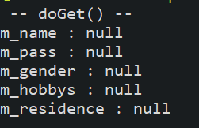
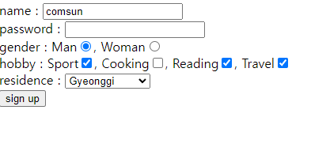
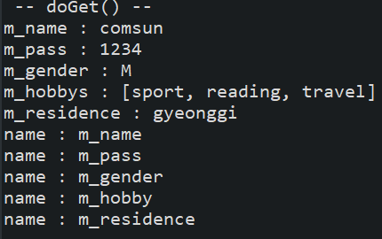
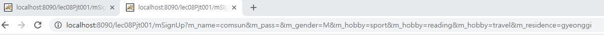
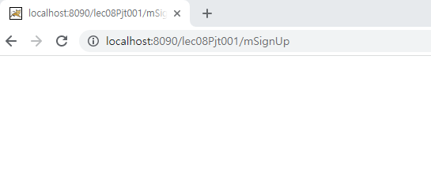
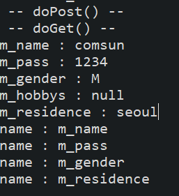

# Form 데이터 처리

학습목표: 사용자의 form 데이터를 Servlet에서 처리하는 방법에 대해 알아보자.

### Form 태그

다음과 같은 Form 태그가 있다.

	<form action="mSignUp" method="get">
		name : <input type="text" name="m_name">  
		password : <input type="password" name="m_pass"> 
		gender : Man<input type="radio" name="m_gender" value="M" checked="checked">, Woman<input type="radio" name="m_gender" value="W"> 
		hobby : Sport<input type="checkbox" name="m_hobby" value="sport">, 
				Cooking<input type="checkbox" name="m_hobby" value="cooking">, 
				Reading<input type="checkbox" name="m_hobby" value="reading">,
				Travel<input type="checkbox" name="m_hobby" value="travel"> 
		residence : <select name="m_residence">
						<option value="seoul" selected="selected">Seoul</option>
						<option value="gyeonggi">Gyeonggi</option>
						<option value="chungcheong">Chungcheong</option>
						<option value="jeonra">Jeonra</option>
						<option value="jeju">Jeju</option>
						<option value="gyeongsang">Gyeongsang</option>
						<option value="gangwon">Gangwon</option>
					</select> 
					<input type="submit" value="sign up">
	</form>

브라우저에서 submit 버튼을 누르면 나의 데이터가 request객체에 의해 서버에 전달된다. 이 때, 서버는 두가지 방식을 통해 데이터를 받을 수 있다. 

1. doGet: 데이터가 웹 브라우저 URL에 노출되어 웹 서버로 전송. 보안에 약하다.
2. doPost: 데이터가 HTTP Request에 포함되어 웹 서버로 전송. 보안에 강하다.

각각의 방식은 Form 태그 내에서 결정할 수 있다.

	<form action="mSignUp" method="get">
	
위의 코드에서 get이면 doGet, post면 doPost방식으로 전달된다.

### doGet, doPost

전달된 데이터가 서블릿에서 어떻게 동작하는지 확인하자. 

* [서블릿 소스코드](./src/com/servlet/MemSignUp.java)
* [form 소스코드](./WebContent/formEx.html)

우선, 서버를 실행시켜보면 다음의 결과가 나온다.

이제 form을 임의로 작성하고 제출을 눌러보자.

form

console

우선, form은  Get방식으로 데이터를 보낸다. 다음과 같이 모든 정보가 url에 보이는 것을 확인할 수 있다.

데이터는 미리 맵핑된 mSignUp 서블릿으로 전달된다. 위의 console창 결과에서 이를 확인할 수 있다. 그런데 개인정보는 보안을 위해 post방식으로 전달하는게 좋다. form을 바꾸고 다시 서버를 실행시켜보자.

	<form action="mSignUp" method="post">
	
### error

분명 method를 post방식으로 바꾸었는데 request는 get방식으로 작동했다. 서버를 재시작 해보고, code또한 잘 보았지만 code가 원인은 아니었다. 내부의 모든 파일을 확인했으나 문제가 될 만한 부분은 보이지 않았다. 원인이 내부적인 요인이 아닌것을 확신한 뒤, 서버의 default 세팅을 크롬에서 internet explorer로 바꾸어보니 문제가 해결됐다. 다시, 이후에 크롬으로 바꾸니 여전히 문제가 반복되었다. 하지만 이번엔 크롬창에서 새로고침을 누르니 문제가 해결됐다.

**html을 변경한 뒤에 브라우저에서 새로고침을 누르자.**

### 다시 doPost

console창을 확인해보면 doPost가 호출된 이후, 내부 로직에 의해 doGet 메서드가 제대로 실행되는것을 확인할 수 있다.
