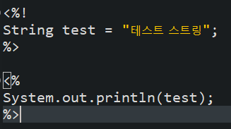
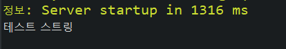
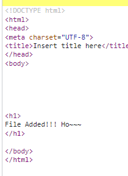

# JSP 스크립트

학습목표: html파일에 java 관련 코드를 삽입하여 jsp 파일을 만드는 방법에 대해 알아보자.

### Servelet vs JSP

* servlet: 순수 java 코드. => .java파일이 컴파일되어 .class파일로 변환
* jsp: html + java언어. aa.jsp 파일 => 컨테이너가 aa_jsp.java파일로 변환 => .class로 컴파일

### JSP 주요 스크립트

선언태그: Jsp 페이지에서 Java의 멤버변수 또는 메서드를 선언

	<%!
	이 안에선 자바코드 다루듯 변수나 메서드를 선언한다.
	%>
	
주석 태그: 컴파일 대상에서 제외시키는 코드

* <%-- ~~ --%>: JSP주석
* <!-- ~~ -->: HTML 주석

스크립트릿 태그: JSP 페이지에서 JAVA 코드를 넣기위한 태그

	<%
	이곳에서 Java 코드를 사용한다.
	%>
	
	
표현식 태그: Java의 변수 및 메서드의 반환값을 출력하는 태그

	num is <%= 반환값%>
	
지시어: 서버에서 jsp 페이지를 처리하는 방법에 대한 정의

1. page: 페이지 기본설정 <% page 속성 = "속성 값" %>
2. include: include file 설정 <%@ include file = "파일 명" %>
3. taglib: 외부라이브러리 태그 설정

### 실습

지금까지 배운 개념을 실습해보자.

* [선언 태그](./WebContent/declareTag.jsp)

선언태그는 변수 혹은 메서드를 선언하기 위한 태그이다.

* [선언 태그 + 스크립트릿 태그](./WebContent/scriptlet.jsp)

스크립트릿 태그는 Java 코드를 넣기위한 태그이다. 간단한 변수를 선언하고, 이를 콘솔창에 출력하는 jsp파일을 만들어보자.

성공적으로 콘솔창에 로그가 찍히는 것을 확인할 수 있다.

이제 include를 연습해보자. 위에서 만든 선언태그 + 스크립트릿 태그에 include를 사용했다.

	<%@ include file = "include.jsp" %>
	

성공적으로 파일이 추가된 것을 확인할 수 있다.

이제 내가 작성한 jsp파일과 브라우저에서 보이는 html 소스코드를 비교해보자.

	<body>
	
	<%!
	String test = "테스트 스트링";
	%>
	
	<%
	System.out.println(test);
	%>
	
	<%@ include file = "include.jsp" %>
	
	</body>
	

	
태그 안에 있는 자바에 관련된 것은 html에서 깔끔하게 보이지 않는다.