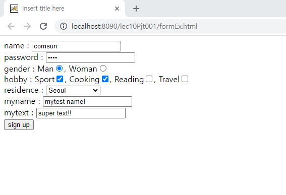
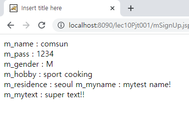
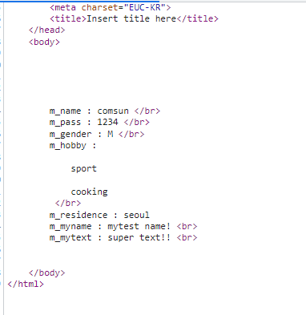
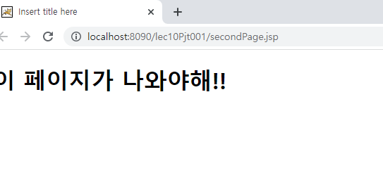

# JSP request, response

학습목표: 사용자의 요청과 web-server의 응답을 담당하는 객체에 대해 학습한다.

### request 객체

이전 문서에서 만들었던 form html을 활용해 jsp 에서 request 객체를 사용해보자.

* [form 소스코드](./WebContent/formEx.html)
* [jsp 소스코드](./WebContent/mSignUp.jsp)

여기에 간단하게 아무 form을 추가하자.

		myname : <input type="text" name="m_myname">  
		mytext : <input type="text" name="m_mytext">  
		
서버를 실행시키면 나오는 form은 다음과 같다. input에 값을 넣고 submit을 누르자.

어떻게 이런 결과가 나오게 된 것일까? jsp를 해부해보자.

		<%!
			String m_name;
			String m_pass;
			String m_gender;
			String[] m_hobby;
			String m_residence;
			String m_myname;
			String m_mytext;
		%>

위 코드블럭은 변수의 선언 태그를 이용한 변수 선언 블럭이다. 
		
		<%
			m_name = request.getParameter("m_name");
			m_pass = request.getParameter("m_pass");
			m_gender = request.getParameter("m_gender");
			m_hobby = request.getParameterValues("m_hobby");
			m_residence = request.getParameter("m_residence");
			m_myname = request.getParameter("m_myname");
			m_mytext = request.getParameter("m_mytext");
		%>
위 태그블럭이 중요하다. 스크립트릿 태그 안에서 request 객체를 쓴 것을 확인할 수 있다. getParameter라는 메서드를 통해 각각의 이름에 해당하는 데이터를 미리 선언했던 변수에 할당했다. 이 중, hobby라는 변수는 배열이다. 그렇기에 getParameterValues라는 다른 메서드를 사용했다.

		m_name : <%= m_name %>  
		m_pass : <%= m_pass %>  
		m_gender : <%= m_gender %>  
		m_hobby :
		<%
		
			for(int i=0; i<m_hobby.length; i++) {
		%>
			<%= m_hobby[i] %>
		<%
			}
		%>  
		m_residence : <%= m_residence %>
		m_myname : <%= m_myname %>  
		m_mytext : <%= m_mytext %>  

마지막으로 각각의 초기화된 변수를 표현식 태그를 통해 직접 html 내에 출력하는 코드이다. 배열을 출력하는 부분만 주의하면 그리 특별할 것은 없다.

위와 같이 깔끔하게 html만 나오는것을 확인할 수 있다.

### response 객체

response 객체는 서버에서 브라우저에 응답하는 객체이다 간단한 실습을 통해 response객체를 사용해보자.

    <body>
    
		<h1>이 페이지가 나오면 안돼!</h1>
		
		<%
			response.sendRedirect("secondPage.jsp");
		%>

    </body>
    
위와 같은 firstPage.jsp 파일을 만들고, 또다른 secondPage라는 jsp를 만들자.

    <body>
    
		<h1>이 페이지가 나와야해!!</h1>

    </body>
    
이제 firstPage를 서버해서 실행시켜보자.

예상했던대로 firstPage는 나오지 않고, secondPage가 나오는 것을 확인할 수 있다. 이는 firstPage 에서 response.sendRedirect라는 메서드가 실행되어, secondPage.jsp라는 응답이 브라우저에 전달됐기 때문이다.