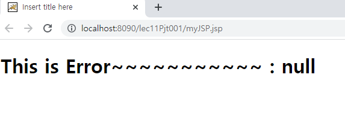

# JSP 내장객체

학습목표: request, response 외 JSP에서 기본적으로 제공하는 객체에 대해 학습한다.

request, response는 jsp에서 제공하는 기본 객체들중 하나이다. 이 두 가지 객체 말고, 다른 객체에대해 알아보자.

### config 객체

config: 이 객체는 처음 서블릿이 콘테이너에서 초기화 될 때, web.xml에서 읽어온 초기화 정보를 갖는다. 즉, 개발자가 미리 서블릿 or JSP에 맵핑해둔 초기화 정보를 저장하고있는 내장객체이다. 코드를 통해 이해해보자.

	<servlet>
	    <servlet-name>servletEx</servlet-name>
	    <jsp-file>/jspEx.jsp</jsp-file>
	</servlet>
위 코드 블럭을 보자. 여기서 servlet-name은 맵핑을 구분하기 위한 이름이다. 다음으로 <jsp-file>이 보인다. 원래 이 자리는 servlet-class가 있었지만, jsp를 사용하기에 jsp-file로 대체했다. <jsp-file> 자리엔 내가 만든 jsp의 파일명을 적는다. 

	<servlet-mapping>
	    <servlet-name>servletEx</servlet-name>
	    <url-pattern>/jspEx.jsp</url-pattern>
	</servlet-mapping>

위 코드는 서블릿 맵핑에 관한 코드다. 다음으로 이 서블릿에서 사용할 초기화 파라미터, Init을 만들자. 

    <init-param>
      <param-name>adminId</param-name>
      <param-value>admin</param-value>
    </init-param>
    <init-param>
      <param-name>adminPw</param-name>
      <param-value>1234</param-value>
    </init-param>

서블릿 안에 adminID와 adminPW라고 명시한 param-name이 보인다. 이 param-name에 해당하는 데이터, 즉 admin과 1234를 config 객체가 가져오는 것이다. jseEx.jsp 의 코드를 보자.

**jspEx.jsp**

		<%!
			String adminId;
			String adminPw;
			
		%>

위 코드블럭에서 변수를 선언한다.

		<%
			adminId = config.getInitParameter("adminId");
			adminPw = config.getInitParameter("adminPw");
		%>
		
위 코드블럭에서 config 객체를 사용한다. 이전에 선언한 adminID 라는 변수에 config.getInitParameter라는 메서드를 사용해 "adminID"라는 이름을 가진 파라미터를 할당한다.
		
		
adminId : <%= adminId %>

		
adminPw : <%= adminPw %>

위 코드블럭에서 표현식 태그를 사용하여 제대로 할당됐는지 확인한다. 확인해보자.

마지막으로, config객체는 하나의 서블릿에서만 데이터를 가져다 쓴다는 점을 명심하자.

### application 객체

application: 하나의 서블릿이 아닌, 모든 JSP에서 데이터를 가져다 쓸 수 있다. config 객체에서 사용했던 <init-param>을 사용하지 않는다. application 객체는 <context-param>을 사용한다. 

직접 application 객체를 만들어보자.

**web.xml**

	  <context-param>
	    <param-name>imgDir</param-name>
	    <param-value>/upload/img</param-value>
	  </context-param>
	  <context-param>
	    <param-name>testServerIP</param-name>
	    <param-value>127.0.0.1</param-value>
	  </context-param>
	  
**myJSP.jsp**

		<%
			imgDir = application.getInitParameter("imgDir");
			testServerIP = application.getInitParameter("testServerIP");
		%>
		
		<h2>imgDir 테스트 : <%= imgDir %></h2>
		<h2>testServerIP 테스트 : <%= testServerIP %></h2>
		
결과

application 객체의 메서드중, setAttribute, getAttribute 메서드가있다. application 객체 특성 상, 어떤 jsp파일에서 setAttribute를 사용했으면 다른 jsp 파일에서 getAttribute를 사용할 수 있다. 이 때, 주의할 점은 getAttribute를 사용할 때 반드시 String으로 형변환을 해야한다.

### out 객체

out객체는 out.print라는 메서드를 제공한다. 마치 HTML을 코딩하듯이 HTML을 출력할 수 있게 해준다.

### exception 객체

exception 객체는 중요하다. 우선 이 객체를 사용하려면 페이지에 다음과 같이 명시해줘야한다.

	<%@ page errorPage="에러페이지.jsp"%>
	
실습을 위해 myErrorPage.jsp라는 JSP를 만들어보자. 만든 에러페이지의 상단에 다음의 코드를 추가하자.
	
	<%@ page isErrorPage="true"%>
	
이것은 이 JSP가 에러페이지라는 의미이다. 만약 에러가 발생했다면 에러페이지를 출력하는 코드를 작성해보자.

	<%
	String msg = exception.getMessage();
	%>
	
위 코드는 msg라는 변수에 exception 객체에서 받은 메시지를 할당한다.

	<h1>
		This is Error~~~~~~~~~~~ :
		<%=msg%>
	</h1>
	
위 코드는 msg를 출력한다. 제대로 작동하는지 확인해보자. 

		<%
			out.print(str.toString());
		%>
		
myJSP.jsp 파일에 추가한 코드이다. 이 코드는 str 이라는 변수를 출력한다. 하지만 소스코드엔 str 변수가 할당되지 않은 상태다. 즉, 에러가 발생한다. 서버에서 이를 실행시켜보자.

에러 메시지가 잘 뜨는것을 확인할 수 있다.