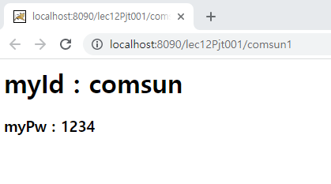
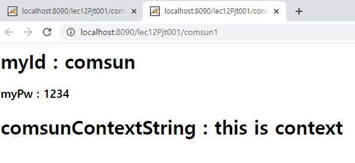
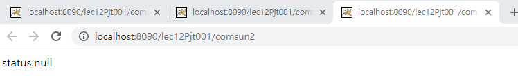
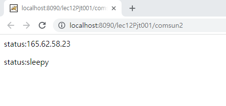

# Servlet 데이터 공유

학습목표: Servlet에서 데이터를 공유하는 방법에 대해 알아보자.

### servlet parameter

서블릿이 구동될 때 필요한 기본적인 parameter 외에, 추가적인 정보가 필요할 때가 있다. 이 경우 해당 정보를 web.xml내에, 혹은 Servlet 안에 직접 넣어둘 수 있다. 직접 Servlet을 만들면서 익숙해져보자.

**myServletEx.java**

	protected void doGet(HttpServletRequest request, HttpServletResponse response) throws ServletException, IOException {
	}
	protected void doPost(HttpServletRequest request, HttpServletResponse response) throws ServletException, IOException {
		doGet(request, response);
	}

myServletEX 라는 서블릿을 만들었다. 이제 url 맵핑을 해야한다. 이전에 배웠던 방법은 두 가지가 있었다. 하나는 Annotation을 이용하는 것, 다른 하나는 직접 web.xml을 수정하는 것이었다. 우선, web.xml을 수정하는 방법을 사용해보자.

**web.xml**

	<servlet>
		<servlet-name>myServletEx</servlet-name>
		<servlet-class>com.servlet.MyServletEx</servlet-class>
	</servlet>

이전에 만들었던 myServletEx파일명에 맞게 코드를 추가했다. 이제 이곳에 init parameter을 추가하자. 그 전에, 개념이 아직 확실하지 않아 init parameter에 대해 다시 한 번 알아보자.

---
**init parameter**: 웹 프로그램은 모든 실행의 시작점이 **웹 서버의 구동**이다. 이 때, web.xml파일이 자동으로 로드된다. 

초기화 파라미터는 웹 페이지가 실행될 때, 즉  바로 위의 경우 필요한 데이터를 전달해준다. 당연히 브라우저가 아닌, 서버로부터의 데이터 전달이다.

WAS가 처음 구동될 때 읽는 파라미터 값을 초기화 파라미터라 한다. 초기화 파라미터는 두 개로 나뉜다.

1. 서블릿 초기화 파라미터
2. 컨텍스트 초기화 파라미터

이전 JSP 내장 객체 문서를 배울때와 유사한 개념이라 생각하자.

---

다시, 아까의 코드로 돌아와 초기화 파라미터를 만들어보자.

		<init-param>
			<param-name>myId</param-name>
			<param-value>comsun</param-value>
		</init-param>
		<init-param>
			<param-name>myPw</param-name>
			<param-value>1234</param-value>
		</init-param>
		
나는 두 개의 파라미터를 저장했다. 아이디와 패스워드이다. 우선 이 상태로 서블릿이 잘 동작하는지 확인해보자. 확인은 out객체를 사용한다.

		String comsunId = getServletConfig().getInitParameter("comsunId");
		String comsunPw = getServletConfig().getInitParameter("comsunPw");
		
		PrintWriter out = response.getWriter();
		out.print("<h1> myId : " + comsunId + "</h1>");
		out.print("<h3> myPw : " + comsunPw + "</h3>");

잘 동작하는것을 확인할 수 있다.

### context parameter

context parameter는 같은 웹 어플리케이션 내에서 모든 서블릿이 같이 공유할 수 있는 매개변수이다. 위의 servlet init parameter와 대비된다. 직접 만들면서 익숙해지자.

**web.xml**

	<context-param>
		<param-name>superContext</param-name>
		<param-value>this is context</param-value>
	</context-param>

**myServletEx.java**

		String comsunContextString = getServletContext().getInitParameter("superContext");
		
		out.print("<h1> comsunContextString : " + comsunContextString + "</h1>");

**결과**

### context attribute

이번엔 컨텍스트 속성을 사용해보자. 우선, 기존의 서블릿에 새로운 속성을 추가하자.

		getServletContext().setAttribute("status", "sleepy");

추가한 속성의 이름 "status", 상태는 sleepy이다. 이제 이것을 사용할 새로운 서블릿을 만들자.

**MyServletGet.java**

		PrintWriter out = response.getWriter();
		
		String status = (String)getServletContext().getAttribute("status");
		
		out.print("
 status:"+ status + "
");
		
**결과**

### error

결과가 자꾸 null이 나왔다. 모든 코드가 강의와 다르지 않은데, 오류가 나길래 원인을 찾아보았다. 

일단, 내가 만든 서블릿은 두 개이다.

1. MyServletEx.java
2. MyServletGet.java

이 중, setAttribute를 작성한 파일은 1번이었다. 모든 코드를 작성한 후, 2번 파일에서 바로 서버를 구동해왔었다. 소스코드를 바로 서버에서 구동하니 당연히 setAttribute가 실행되지 않은 상태에서 getAttribute를 사용한 것이다.   

---

해결: 1번 파일을 서버에서 구동한 후, 주소창에 맵핑해둔 comsun2를 치고 들어가니 잘 동작했다. (status 다음 아이피 주소는 오류를 찾는 도중 만든 것이니 무시)

