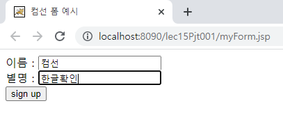
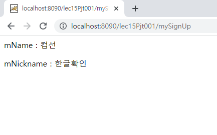

# 한글처리

학습목표: 한글이 정상적으로 출력될 수 있는 방법에 대해 학습한다.

### 한글 처리

브라우저 -> 웹서버

* post: 서블릿에 UTF-8 추가
* get: server.xml에 UTF-8 추가

실습

**mySignUp.java**

	protected void doGet(HttpServletRequest request, HttpServletResponse response) throws ServletException, IOException {
		request.setCharacterEncoding("UTF-8");
		
		response.setContentType("text/html; charset=UTF-8");
		
		PrintWriter out = response.getWriter();
		String mName = request.getParameter("m_name");
		String mNickname = request.getParameter("m_nickname");
		
		out.print("
 mName : " + mName + "
");
		out.print("
 mNickname : " + mNickname + "
");
	
	}
	protected void doPost(HttpServletRequest request, HttpServletResponse response) throws ServletException, IOException {
		doGet(request, response);
	}

위와같은 서블릿을 만든다. 한글을 사용하기 위해 request 와 response 객체에 UTF-8을 추가했다.

다음으로 form을 만들자.

**myForm.jsp**

		<form action="mySignUp" method="post">
			이름 : <input type="text" name="m_name">  
			별명 : <input type="text" name="m_nickname">  
				<input type="submit" value="sign up">
		</form>

같단한 폼을 만들었다. 원래였다면 form 양식에 한글을 입력했을 때 문자가 깨졌다. 직접 한글을 입력해 확인해보자.

한글이 깨지지 않고 잘 나오는 것을 확인할 수 있다.

### Filter

브라우저 - 서버간 통신에서 항상 필터를 거친다. 이 때 인코딩을 UTF-8 로 설정하면 일일이 UTF-8을 사용하지 않고도 한글이 출력되게 할 수 있다.

필터를 사용하기 위해선 다음과같은 사실을 인지하자.

1. init, doFilter, destroy
2. web.xml에서 filter 설정
3. web.xml에서 필터 맵핑을 /*로(모든 url이 필터를 거치게)