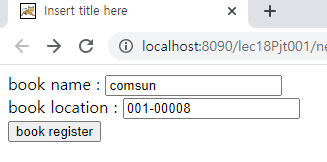
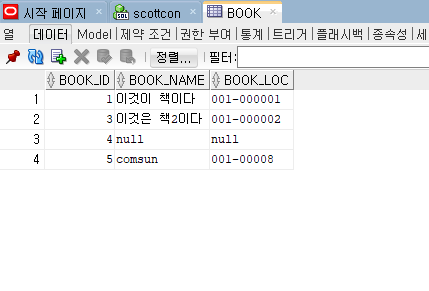

# JDBC

학습목표: Java와 오라클이 통신할 수 있는 방법에 대해 학습한다.

JDBC: 자바와 DB가 통신할수 있게 해주는 API

### JDBC 설정

### JDBC를 이용한 데이터 관리

JDBC 실행순서

1. Driver loading: 오라클드라이버 로딩
2. Connection: connection객체를 통해 java와 Oracle 연결
3. Statement: Statement 객체를 통해 query 전송
4. query: 쿼리 작성. 
5. run: 쿼리 전송

코드를 보며 각각의 과정이 어느 코드에 해당하는지 확인하자.

**NewBook.java**

		String driver = "oracle.jdbc.driver.OracleDriver";
		String url = "jdbc:oracle:thin:@localhost:1521:xe";
		String id = "scott";
		String pw = "tiger";
		
여기서 총 4개의 string형 변수를 초기화했다.

1. driver: 이 변수는 오라클 드라이버를 로딩한다.
2. url: 이 변수는 주소를 저장한다. 지금은 연습 환경이기에 localhost를 사용하지만 실무라면 아이피를 사용한다.
3. id: 로그인하는데 필요한 ID
4. pw: 로그인하는데 필요한 비밀번호

		Connection con = null;
		Statement stmt = null;
		
		try {
			Class.forName(driver);
			
			con = DriverManager.getConnection(url, id, pw);
			
여기서 connection 객체를 통해 java와 oracle을 연결한다. 이전에  초기화했던 driver, url, id, pw를 모두 사용하는것을 알 수 있다.

			stmt = con.createStatement();
			
여기서 statement 객체를 통해 쿼리를 전송한다.

			String sql = "INSERT INTO book(book_id, book_name, book_loc)";
					sql += " VALUES (BOOK_SEQ.NEXTVAL, '" + bookName + "', '" + bookLoc + "')";
			int result = stmt.executeUpdate(sql);
			
여기서 쿼리문을 작성한다. 이 때, 네트워크 상에 여러 문제가 있을 수 있다. 그렇기에  항상 try-catch문으로 예외를 설정해야한다.

			if(result == 1) {
				out.print("INSERT success!!");
			} else {
				out.print("INSERT fail!!");
			}
			
		} catch (Exception e) {
			e.printStackTrace();
		} finally {
			try {
				if(stmt != null) stmt.close();
				if(con != null) con.close();
				
지금까지 리소스를 사용했기에, 다시 해제해줘야한다. statement 객체와 connection 객체가 null이 아닐경우 close함으로 리소스를 해제한다.

			} catch (Exception e2) {
				e2.printStackTrace();
			}
		}
		
	}

이번엔 직접 jsp를 실행시켜서 데이터베이스와 제대로 연동됐는지 확인해보자.

위와같이 입력한 뒤 submit하자.

데이터가 잘 연동됐음을 알 수 있다.
### PreparedStatement

PreparedStatement는 쿼리문이 지저분해지는것을 개선하기 위해 사용한다. ?를 사용하여 쿼리문을 만들고, PreparedStatement객체를  이용하여 ?에 해당하는 부분을 채운다. 또한, 순서도 조금 다르다.

NewbBook.java에서 만든 코드와 비교해보자.

**BookServlet.java**

		Class.forName(driver);
			
			con = DriverManager.getConnection(url, id, pw);
			stmt = con.createStatement();
			String sql = "SELECT * FROM book";
			res = stmt.executeQuery(sql);

위의 코드는 이전의 NewBook.java 코드와 분명히 구분되는 점이 있다. 이 코드는 SELECT를 사용한다는 점이다.

* SELECT: 데이터 셀렉트 - 메서드가 executeQuery, 반환값 resultset (여러개)
* INSERT: 데이터 수정, 삭제, 추가 - 메서드가 executeUpdate, 반환값 result(하나)

			while (res.next()) {
				int bookId = res.getInt("book_id");
				String bookName = res.getString("book_name");
				String bookLoc = res.getString("book_loc");
				
				out.print("bookId : " + bookId + ", ");
				out.print("bookName : " + bookName + ", ");
				out.print("bookLoc : " + bookLoc + " ");
			}
			
이제 직접 PreparedStatement를 사용해보자.

**ModifyBook**

			String sql = "UPDATE book SET book_loc = ? WHERE book_name = ?";
					
			pstmt = con.prepareStatement(sql);
			pstmt.setString(1, "001-00007123");
			pstmt.setString(2, "book7");
			
위와 같이 쿼리문을 ?를 사용해 반만 완성한다. 다음으로  setString으로 첫번째 물음표에 해당하는 데이터를 넣어주고, 이를 반복한다.