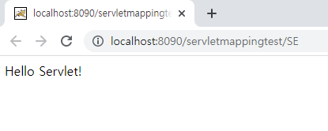
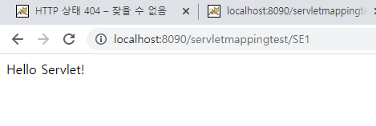

# Servlet 맵핑

자바 웹 프로그래밍을 하는 경우 JSP와 Servlet 두 가지를 혼용한다.

* JSP: 주로 View에 해당하는 부분을 만들때 사용한다.
* Servlet: Controller, model 등을 만들때 사용한다.

서블릿 맵핑을 사용하는 이유: 브라우저에서 request => 웹 컨테이너 안의 여러 servlet 중, 맞는 주소를 찾아가야함 => 이 주소를 구분하기 위해 Path 사용. Path엔 두 가지가 있다.

* full path:복잡함 + 보안 취약

* mapping path: 위의 복잡한 URL을 닉네임처럼 간단하게 표현하여 full path를 찾는 것과 동일한 효과를 낸다.

맵핑을 하는 방법은 2가지.

1. web.xml

2. Java Annotation

우선 1번 방법을 알아보자.

### web.xml 수정

		<servlet>
			<servlet-name>servletEx</servlet-name>
			<servlet-class>com.servlet.ServletEx</servlet-class>
		</servlet>
		<servlet-mapping>
			<servlet-name>servletEx</servlet-name>
			<url-pattern>/SE</url-pattern>
		</servlet-mapping>
		
위와같이 코드를 만들었다. servlet-class 는 full path다. 아래의 url-pattern은 내가 만들 간단한 path다. 이제 서버를 실행시켜보자.

SE라는 간단한 주소에서 내가 만든 servlet이 잘 뜨는것을 확인할 수 있다.

### Annotation

ServletEX.java 파일에서 상단의 

	@WebServlet("/SE1")
	
를 수정했다. 그리고 서버를 실행해보았다.

web.xml을 수정한것과 동일한 결과를 확인할 수 있다.

