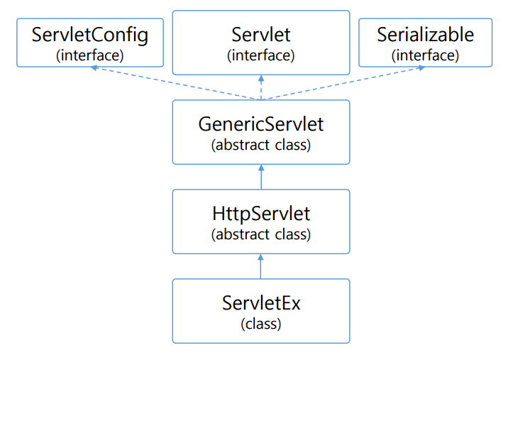
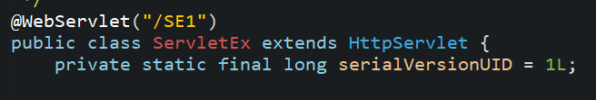
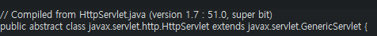
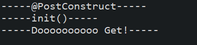

# Servlet request, response

클라이언트와 서버의 상호작용에 대해 간단하게 복습하자.

브라우저에서 사용자의 요청 <=> 서버에서의 응답.

이 상황에서 분명하게 해야 할 점은, 로컬 환경이 아니라는 것이다. 웹 서버는 프로토콜을 이용한 통신이기에 그 과정에서 많은 데이터가 오고간다. 이에 따라 수많은 기능이 필요해진다. 개발자가 코드를 작성할 때마다 하나하나 그것을 작성하는것은 비효율적이다. 그렇기에 개발 환경에서 servlet을 생성할 때, 필요한 기능을 미리 구현해놓았다. 그 구조를 살펴보자.

이전에 만들었던 코드를 통해 이를 확인하자.

ServletEx를 생성했는데 HttpServlet을 상속하는 것을 볼 수 있다. 그리고 그 HttpServlet은 추상클래이이며, GenericServlet을 상속한다.

여기까지 알았으면 request와 response를 보자.

	protected void doGet(HttpServletRequest request, HttpServletResponse response)
				throws ServletException, IOException {
		response.getWriter().append("Served at: ").append(request.getContextPath());
	}
	protected void doPost(HttpServletRequest request, HttpServletResponse response)
			throws ServletException, IOException {
		doGet(request, response);
	}
	
먼저 doGet과 doPost 메소드가 보인다. 둘 다 사용자 요청에 응답하는 메소드이다. Get방식일때 응답하는 메소드, Post방식일때 응답하는 메소드라고 생각하자. 여기서 확인해야 할 것이 각각의 인자이다.

	protected void doGet(HttpServletRequest request, HttpServletResponse response)
	
각각의 메소드에 request, response 객체를 인자로 갖는것을 볼 수 있다. 그 둘의 정의는 다음과 같다.

* request : 사용자가 요청할 때 요청에 대한 기능과 속성을 갖는 객체
* response: 응답에 대한 정보를 갖는 객체

요청에 관한 처리를 할 때는 request객체를, 응답에 관한 처리를 할 때는 response 객체를 사용하여 기능을 구현할 수 있다.

# Servlet Life Cycle

### Servlet 생명주기

* @PostConstruct
* init()
* service 
* destroy()
* @PreDestroy

### 생명주기 관련 메서드

실습을 통해 생명주기 메서드에 대해 알아보자. 다음과 같이 코드를 작성한다.

	@PostConstruct
		public void pc() {
			System.out.println("-----@PostConstruct-----");
		}
	
	@Override
	public void init() throws ServletException {
		System.out.println("-----init()-----");
	}
	
	@Override
	public void destroy() {
		System.out.println("-----파괴광선-----");
	}
	
	@PreDestroy
	public void pd() {
		System.out.println("-----파괴광선 끝-----");
	}

서버를 실행시키자.

배웠던 바와 같이, 가장 먼저 PostConstruct가 실행된다. 다음에 init()이 호출되고, DoGet 메서드가 실행된다. 하지만 destroy 메서드는 실행되지 않는다. 서블릿이 아직 실행중이기 때문이다.
