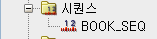
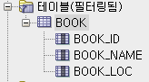
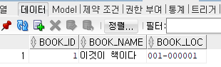
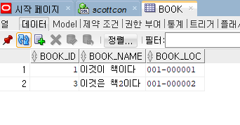

# SQL

학습목표: 데이터베이스의 데이터를 다루기 위한 SQL문에 대해 학습한다.

학습환경: Oracle DBMS, Oracle SQL Developer

### 테이블 생성 및 삭제

**테이블 생성**

	CREATE TABLE book (
	book_id NUMBER(4),
	book_name VARCHAR2(20),
	book_loc VARCHAR2(20)
	);

테이블을 생성하려면 CREATE TABLE을 입력한다. book_id는 열의 이름, 뒤에 오는 NUMBER, VARCHAR2는 자료형이다.

**테이블 검색**

	SELECT * FROM tab;
	
여기서 tab는 사용자가 소유한 테이블의 정보를 알려준다.

**테이블 삭제**

	DROP TABLE book;

DROP가 삭제 명령어다.

** 테이블 생성 +제약조건

	CREATE TABLE book (
	book_id NUMBER(4) CONSTRAINT  book_id_pk PRIMARY KEY,
	book_name VARCHAR2(20),
	book_loc VARCHAR2(20)
	);
	
위 명령어중 CONSTRAINT 라는 명령어를 통해 프라이머리 키를 생성한다.

### 데이터 추가, 수정, 삭제

데이터를 추가, 수정하기 위해 필수적으로 알아야하는 개념이 있다. 시퀀스이다.

시퀀스: 데이터베이스 객체이다. 순차적으로 증가하는 순번을 반환한다.

직접 시퀀스를 만들며 이해하자.

	CREATE SEQUENCE book_seq;

위와같은 명령어를 통해 시퀀스를 만들수 있다.

반대로, 시퀀스를 삭제할수도 있다.

	DROP SEQUENCE book_seq;
	
이제 직접 데이터를 추가해보자.

**데이터 추가**

	INSERT INTO
	    book(book_id, book_name, book_loc)
	VALUES
	    (BOOK_SEQ.NEXTVAL, '이것이 책이다', '001-000001');

SQL문을 해석해보자.

	INSERT INTO
	    book(book_id, book_name, book_loc)
위 코드는 book이라는 테이블에 각각 book_id, book_name, book_loc 라는 컬럼에 데이터를 집어 넣는다는 의미이다.

	VALUES
	    (BOOK_SEQ.NEXTVAL, '이것이 책이다', '001-000001');
	    
위 코드는 순서대로 book_id라는 열에 위에서 만든 book_seq객체를, book_name 열에 '이것이 책이다'를 집어넣는다는 의미이다. 여기까지 한 뒤 명령문을 실행하고 commit해주자.

실제로 book 테이블에 데이터가 들어갔는지 확인해보자.

자, 위의 결과에서 book_id를 잘 살펴보자. BOOK_SEQ.NEXTVAL의 결과로 1이 잘 나온것을 확인할 수 있다. 2를 출력하기 위해 하나 더 만들어보자.

	INSERT INTO
	    book(book_id, book_name, book_loc)
	VALUES
	    (BOOK_SEQ.NEXTVAL, '이것은 책2이다', '001-000002');

중간에 오류가 떠서 2 대신 3이라는 결과가 나왔지만, 예상했던대로 1씩 증가한 값이 잘 들어갔음을 알 수 있다.
###  데이터 검색

SELECT 명령어를 사용한다.

* SELECT * FROM :데이터 검색 명령어
* AS: 데이터의 컬럼 명을 임시로 원하는 단어로 뽑아낸다

조건문

* WHERE: 조건문
* LIKE: 지정한 것이 들어간 구문.

정렬

* ORDER BY: 오름차순(ASC), 내림차순(DESC)